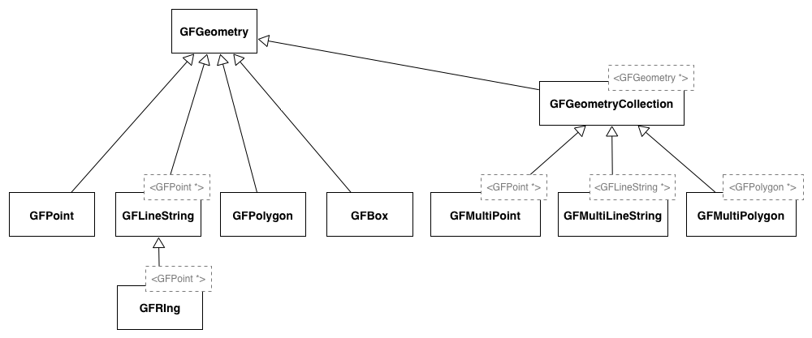

# GeoFeatures

[](https://travis-ci.org/tonystone/geofeatures)
[](http://codecov.io/github/tonystone/geofeatures?branch=master)
[](http://cocoapods.org/pods/GeoFeatures)
[](http://cocoapods.org/pods/GeoFeatures)
[](http://cocoapods.org/pods/GeoFeatures)

## Introduction

GeoFeatures is a lightweight, high performance geometry library for Objective-C.  It supports the full
 set of geometric primitives such as Point, Polygon, and LineString as well as collection classes such as MultiPoint, MultiPolygon,and MultiLineString.



## Features

- Easy to use.
- Point, MultiPoint, LineString, MultiLineString, Polygon, MultiPolygon, Box and GeometryCollection implementations.
- Area, Length, BoundingBox, Centroid, Perimeter, Union, and Within (point in polygon) algorithms.  More coming soon.
- Immutable and mutable versions of all classes (e.g. `GFPolygon` and `GFMutablePolygon`).
- [WKT (Well-Known-Text)](https://en.wikipedia.org/wiki/Well-known_text) input and output.
- [GeoJSON] (http://geojson.org/) input and output.
- MapKit representations and drawing.
- Indexed Subscripting support for all collection types (e.g. `GEPoint * point = multiPoint[0]`).
- **Swift**: supports direct use in Swift applications.
- CocoaPod framework support (compile as Objective-C framework or static lib).
- Open Sourced under the the [Apache License, Version 2.0] (http://www.apache.org/licenses/LICENSE-2.0.html).
- Comprehensive doxygen documentation of the library available at [github.io] (http://tonystone.github.io/geofeatures).
- Implemented based on the popular and fast open source C++ boost geometry library.
 
## Documentation

The doxygen documentation is online available at [github.io] (http://tonystone.github.io/geofeatures).

## Sources and Binaries

You can find the latest sources and binaries on [github] (https://github.com/tonystone/geofeatures).

## Communication and Contributions

- If you **need help**, use [Stack Overflow](http://stackoverflow.com/questions/tagged/geofeatures). (Tag 'geofeatures')
- If you would like to **ask a general question**, use [Stack Overflow](http://stackoverflow.com/questions/tagged/geofeatures). (Tag 'geofeatures')
- If you **found a bug**, _and can provide steps to reliably reproduce it_, [open an issue] (https://github.com/tonystone/geofeatures/issues).
- If you **have a feature request**, [open an issue] (https://github.com/tonystone/geofeatures/issues).
- If you **want to contribute**
   - Fork it! [GeoFeatures repository] (https://github.com/tonystone/geofeatures)
   - Create your feature branch: `git checkout -b my-new-feature`
   - Commit your changes: `git commit -am 'Add some feature'`
   - Push to the branch: `git push origin my-new-feature`
   - Submit a pull request :-)

## Installation

GeoFeatures is available through [CocoaPods](http://cocoapods.org). To install
it, simply add the following line to your Podfile:

```ruby
pod "GeoFeatures"
```

See the ["Using CocoaPods"](https://guides.cocoapods.org/using/using-cocoapods.html) guide for more information.

## Author

Tony Stone

## License

GeoFeatures is released under the [Apache License, Version 2.0] (http://www.apache.org/licenses/LICENSE-2.0.html)

The embedded Boost library is released under the [Boost Software License, Version 1.0] (http://www.boost.org/users/license.html)
